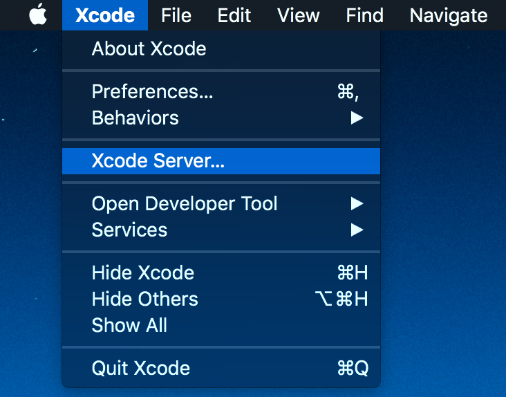
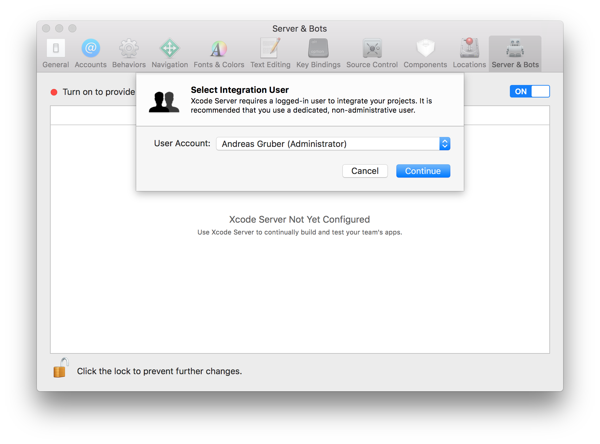
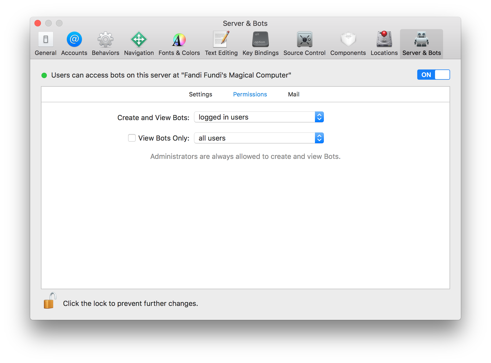

# Setup Xcode Build Server

1.) Open Xcode server preferences on your build machine.

  

2.) Toggle Switch to on

3.) Select User which should be used to integrate

4.) Change permission, so only logged in user can create and view bots.

