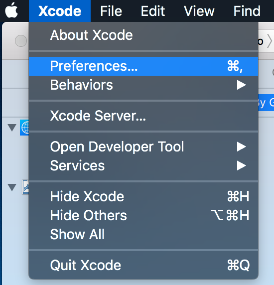
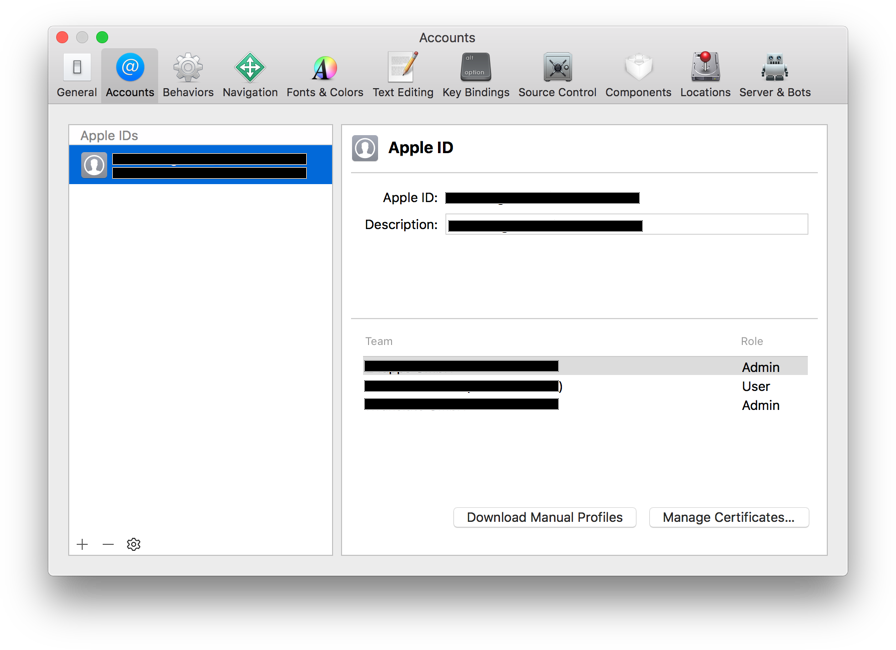
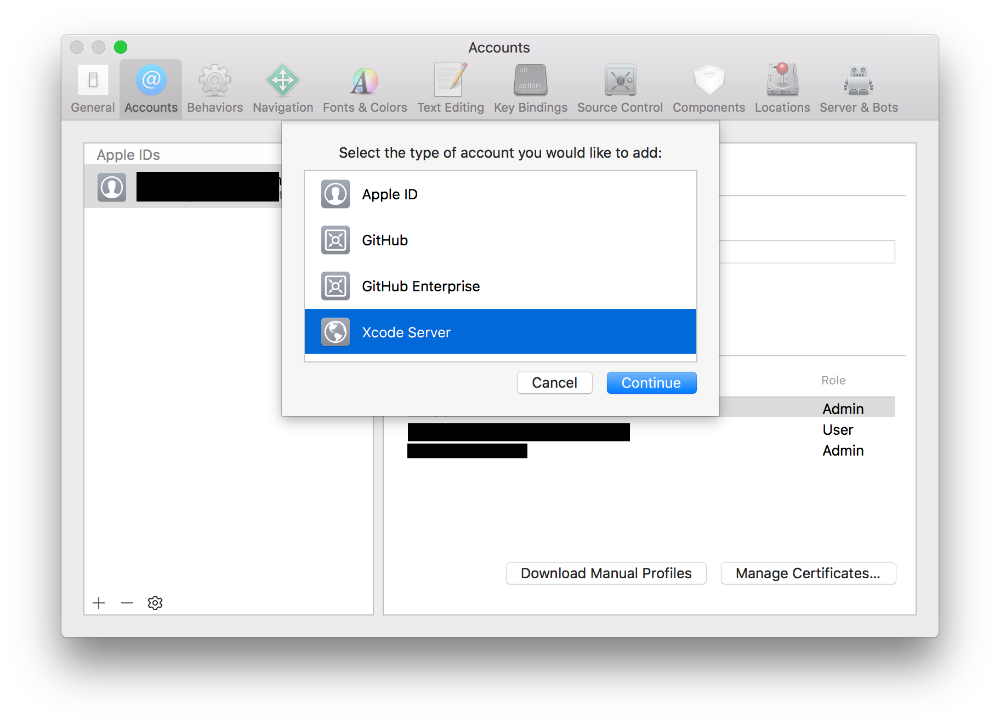
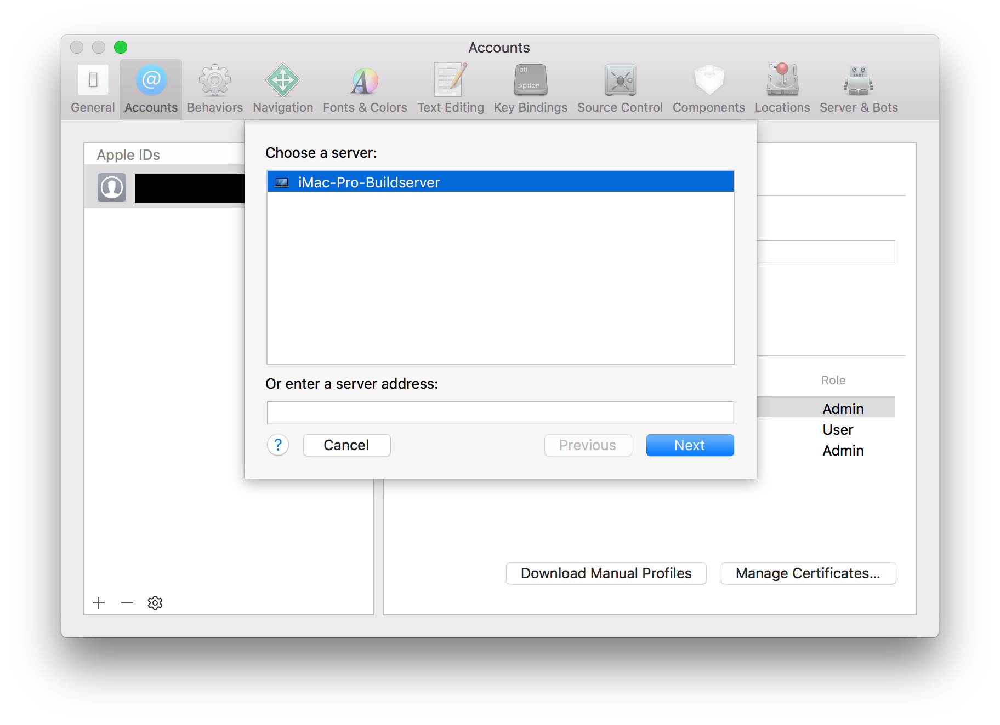
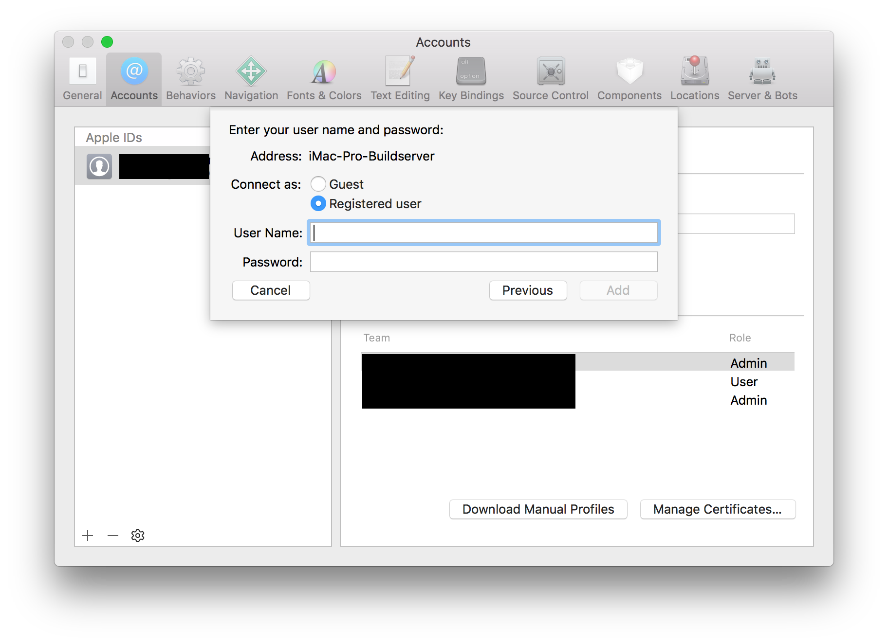

# Connect to Build Server

1.) Open your local Xcode and go into Preferences.

2.) Switch to the tab called "Accounts".

3.) Press the plus sign to add a new Account.   Then select Xcode Server an press continue.

4.) Select Xcode Server and press next.

5.) Enter your Build Server User Credentials

