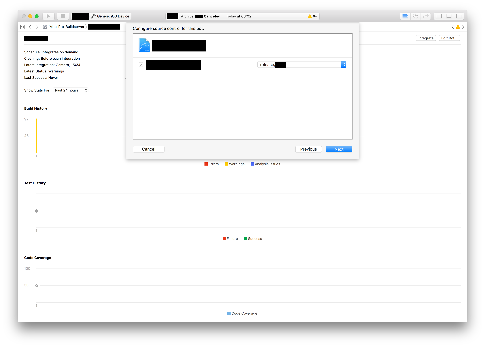
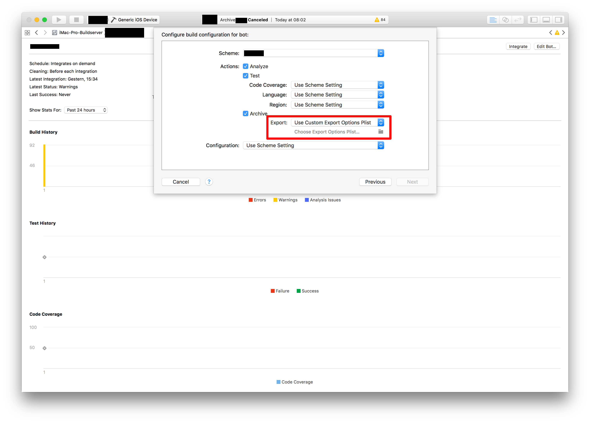

# Create your first bot

1.) Switch to Report Navigator.  
 

2.) Right click on Build Server and press "Create Bot".  

3.) Add your Git Repository, enter credentials and select branch to build. Press next.

4.) Change Archive Export option to "Use Custom Export Options Plist".

5.) Select previously exported "ExportOptions.list" and press next.

6.) Configure bot build scheduler or set it to manually. Press Next.

7.) Add certificates required by project to build server. Press Next.

8.) Set FASTLANE_PASSWORD (App Store Connect password). Press Next.  
*Keychain tutorial coming soon*

9.) Add new Post-Integration Script

10.) Insert fastlane pilot command to upload the ipa for successfull builds. Press Done.

