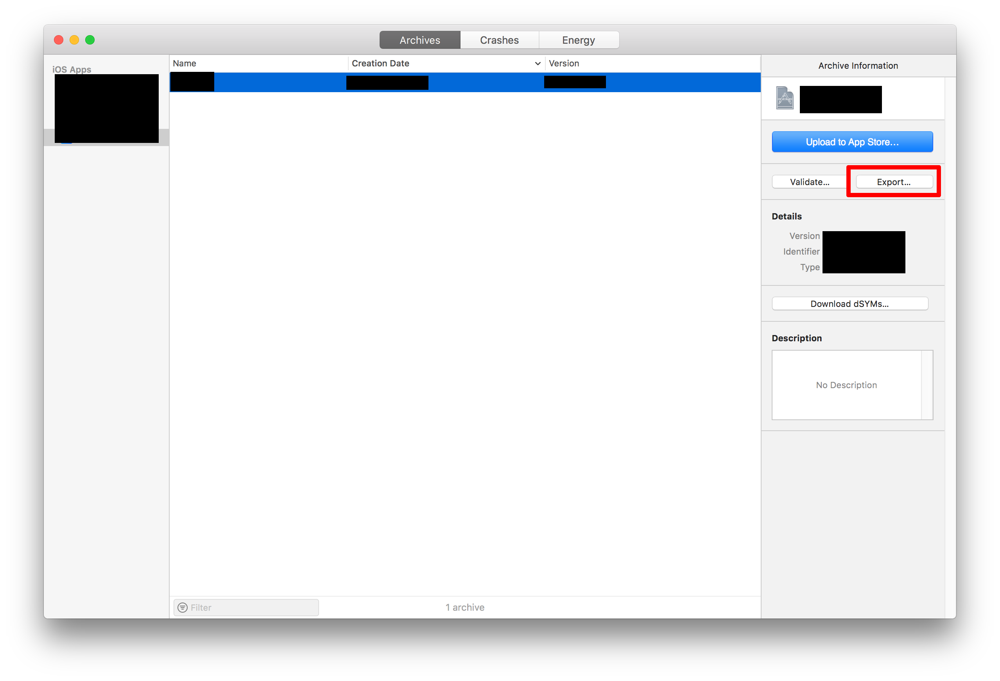

# Prepare your Project

1.) Set signing to manually and fix all errors.

2.) Archive your Product

3.) Open Organizer

4.) Select your current build archive and press export

5.) Check App Store and press next

6.) Select the options that fits for your project

7.) Select distribution certificate and set provisioning profile.

7.) Press next

8.) Save export folder to local filesystem. (You should remember the path to this directory)

9.) Copy ExportOptions.plist from export directory to your project root. (We need that file later.)

